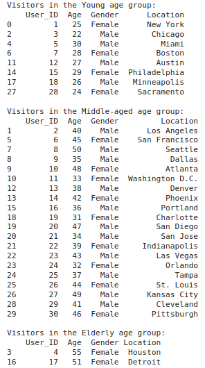
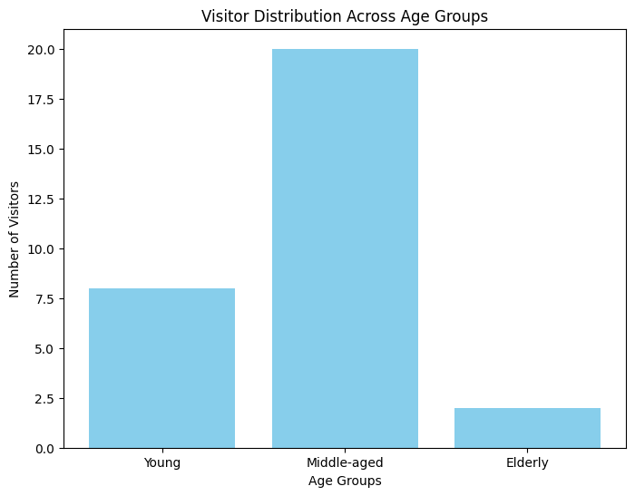

### EX4 Implementation of Cluster and Visitor Segmentation for Navigation patterns
### DATE: 17/09/2024
### AIM: To implement Cluster and Visitor Segmentation for Navigation patterns in Python.
### Description:
<div align= "justify">Cluster visitor segmentation refers to the process of grouping or categorizing visitors to a website, 
  application, or physical location into distinct clusters or segments based on various characteristics or behaviors they exhibit. 
  This segmentation allows businesses or organizations to better understand their audience and tailor their strategies, marketing efforts, 
  or services to meet the specific needs and preferences of each cluster.</div>
  
### Procedure:
1) Read the CSV file: Use pd.read_csv to load the CSV file into a pandas DataFrame.
2) Define Age Groups by creating a dictionary containing age group conditions using Boolean conditions.
3) Segment Visitors by iterating through the dictionary and filter the visitors into respective age groups.
4) Visualize the result using matplotlib.

### Program:
```md
Name : Sam Israel D
Reg. No : 212222230128
```
```python
import pandas as pd
import matplotlib.pyplot as plt

# Visitor segmentation based on characterisitics

# Read the data
visitor_df = pd.read_csv('clustervisitor.csv')

# Perform segmentation based on characteristics (e.g., age groups)
age_groups = {
    'Young' : (visitor_df['Age'] <= 30),
    'Middle-aged' : ((visitor_df['Age'] > 30) & ((visitor_df['Age'] <= 50))),
    'Elderly' : (visitor_df['Age'] > 50)
}
print(age_groups)

for group, condition in age_groups.items():
    visitors_in_group = visitor_df[condition]
    print(f"Visitors in the {group} age group:")
    print(visitors_in_group)
    print()

```
### Output:


### Visualization:
```python
# Create a list to store counts of visitors in each age group
visitor_counts = []

# Count visitors in each age group
for group, condition in age_groups.items():
    visitors_in_group = visitor_df[condition]
    visitor_counts.append(len(visitors_in_group))

# Define age group labels and plot a bar chart
age_group_labels = list(age_groups.keys())

plt.figure(figsize = (8,6))
plt.bar(age_group_labels, visitor_counts, color = 'skyblue')
plt.xlabel('Age Groups')
plt.ylabel('Number of Visitors')
plt.title('Visitor Distribution Across Age Groups')
plt.show()
```
### Output:


### Result:
Thus, Cluster and Visitor Segmentation for Navigation patterns has been successfully implemented using Python.
